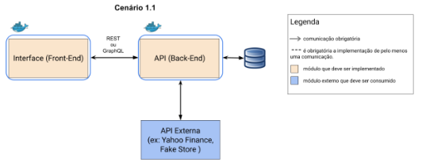

# MVP Arquitetura de Software — API

Este projeto é a componente de Back-End do MVP da Sprint **Arquitetura de Software** do Curso de Engenharia de Software da PUC-Rio.

O MVP é composto de um Back-End com API REST desenvolvida em Python com Flask para o gerenciamento de **alunos e turmas escolares**. A aplicação utiliza **SQLite** para persistência, disponibiliza documentação OpenAPI/Swagger e integra uma **API externa pública (ViaCEP)** para consultar e tratar endereços a partir do CEP informado no cadastro de alunos. A parte do front-end pode ser acessada em [MVP-Arquitetura-de-Software-Interface-PucRio](https://github.com/barrococarolina/MVP-Arquitetura-de-Software-Interface-PucRio).

## Arquitetura



O fluxo principal é: **Front-End → API principal → ViaCEP**, com persistência dos dados tratados no **SQLite**.

A API principal recebe o CEP enviado pelo Front-End, consulta o ViaCEP, trata a resposta e persiste os dados de endereço junto ao aluno. O Front-End não redireciona o usuário para o ViaCEP.

## Tecnologias

- Python 3.12+
- Flask
- flask-openapi3
- Pydantic
- SQLAlchemy
- SQLite
- Requests
- Flask-CORS
- Docker

## API externa — ViaCEP

**Serviço:** ViaCEP  
**Site:** https://viacep.com.br/  
**Cadastro:** não é necessário para o uso básico.  
**Custo:** serviço público e gratuito.  
**Finalidade:** consulta de endereço a partir do CEP.

### Rota utilizada

```text
GET https://viacep.com.br/ws/{CEP}/json/
```

Exemplo:

```text
GET https://viacep.com.br/ws/22790000/json/
```

A API principal utiliza os campos retornados pelo serviço (`logradouro`, `bairro`, `localidade`, `uf` e `cep`) e os transforma nos dados persistidos do aluno.

> Consulte a documentação oficial do ViaCEP para informações atualizadas sobre o serviço e suas condições de uso.

## Rotas da API principal

### Alunos

| Método | Rota | Função |
|---|---|---|
| GET | `/aluno` | Lista alunos; aceita `buscaNome`, `turmaId` e `ordenar` |
| GET | `/aluno/{id}` | Consulta um aluno pelo ID |
| POST | `/aluno` | Cadastra aluno e consulta o ViaCEP |
| PUT | `/aluno/{id}` | Edita um aluno e atualiza o endereço pelo ViaCEP |
| DELETE | `/aluno/{id}` | Exclui um aluno |

### Turmas

| Método | Rota | Função |
|---|---|---|
| GET | `/turma` | Lista turmas |
| GET | `/turma/{id}` | Consulta uma turma pelo ID |
| POST | `/turma` | Cadastra turma |
| PUT | `/turma/{id}` | Edita turma |
| DELETE | `/turma/{id}` | Exclui turma sem alunos vinculados |

## Funcionalidades extras

Além disso, a API implementa:

- Consulta automática de endereço por CEP.
- Persistência dos dados de endereço no SQLite.
- Busca de alunos por nome ou e-mail.
- Filtro de alunos por turma.
- Ordenação por nome ou quantidade de faltas.
- Validação de existência da turma antes do cadastro/edição do aluno.
- Tratamento de erros do serviço externo.
- Bloqueio da exclusão de turmas que possuem alunos vinculados.


## Execução local

### 1. Criar ambiente virtual

Windows:

```bash
python -m venv venv
venv\Scripts\activate
```

Linux/macOS:

```bash
python3 -m venv venv
source venv/bin/activate
```

### 2. Instalar dependências

```bash
pip install -r requirements.txt
```

### 3. Executar

```bash
python app.py
```

A API ficará disponível em:

```text
http://localhost:5000
```

A documentação OpenAPI/Swagger ficará disponível em:

```text
http://localhost:5000/openapi
```

## Execução com Docker

Construir a imagem:

```bash
docker build -t gerenciamento-escolar-api .
```

Executar o container:

```bash
docker run --name gerenciamento-escolar-api -p 5000:5000 -v escola_database:/app/database gerenciamento-escolar-api
```

O volume `escola_database` mantém o SQLite mesmo que o container seja recriado.

## Teste

Depois de iniciar a API, crie uma turma pelo Swagger e depois cadastre um aluno informando um CEP válido. O cadastro do aluno acionará o ViaCEP automaticamente.

## Repositório do Front-End

O Front-End desta aplicação está em um repositório separado, conforme exigido pelo MVP.
